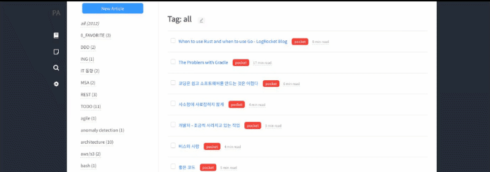
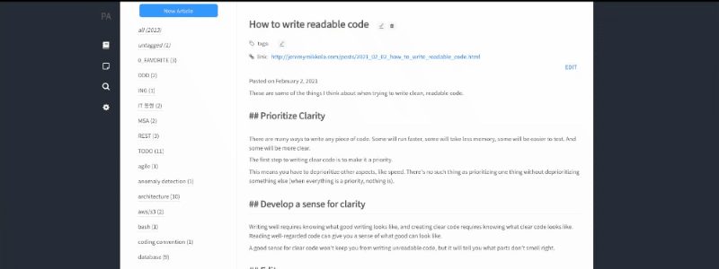
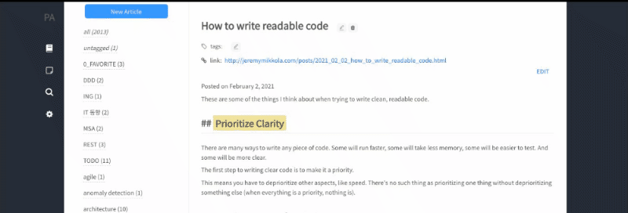
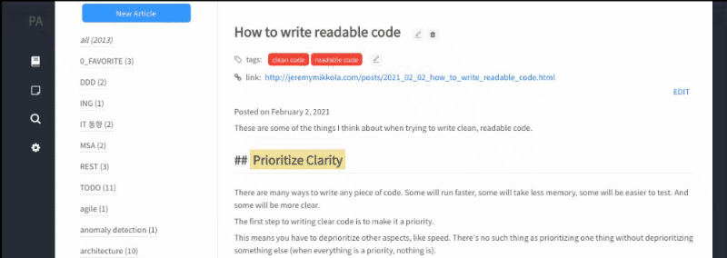
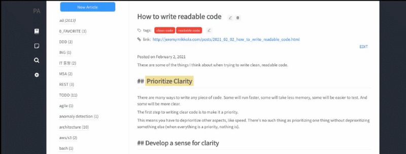
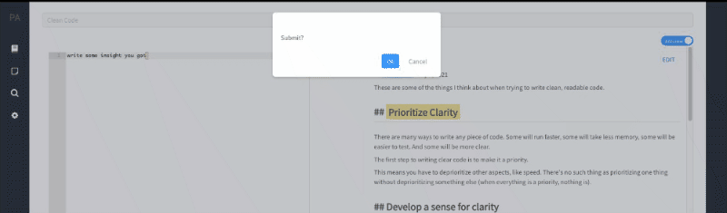
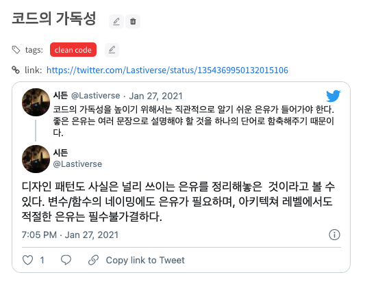
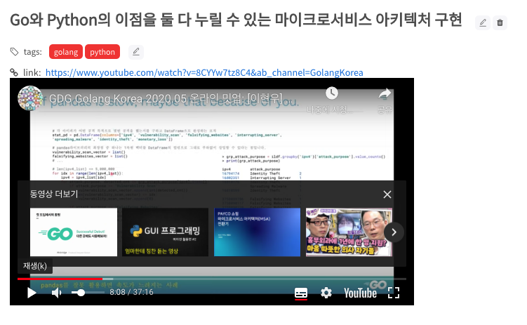

# How do I use it

I found a fantastic article while surfing the Internet. I really want to learn this and leave it for a long time. What do you do when that happens?
Is it enough just to read it once? It wasn't to me. I don't have a good memory. I will remember what I read today properly tomorrow maybe, but there is no guarantee that it will be like that after a month.
So this is how I use it.

1. Read the article carefully enough.
2. Underline the important or impressive parts.
3. Write a summary of what I read again. Completely with my sentences.

How about you? I have learned a lot of useful things through this way.
Unfortunately, I couldn't find the right tools to help this process. So I made it myself.

Now I'll show you how to use this Personal-Archive to get it right.

---

1. I found an article on the Internet that I want to leave behind. Copy the URL and paste it into the Personal-Archive.
   After a while, the writing was saved as it is. With mardown format!
   

2. You can also modify it if necessary. I usually summarize the contents or mark impressive parts.
   I like VI, so I edited it using VI mode.
   I have a shortcut for those who are lazy to move their hands with the mouse. Press Ctrl+j,k to scroll through loaded articles.

> Input three asterisk like * * * blahblah * * * to get the highlight.

3. Now, let's choose the appropriate tags for this article. 
   I will choose two tags: 'clean code', 'readable code'

4. We can use these tags to find useful articles later, right? 
   Oh, of course, you can search.

5. Let's write a brief summary based on this article. Completely with my sentences.
   Go to the Notes tab and click on the 'Clean Code' note. I made this note before, so I'll add a new paragraph here.

6. Let's bring in the article as a reference. Click the "add article reference" button and enter a search term to recall the article you just added.
   It's loaded on the right side.
   I write down my own summary by referring to the article.

7. Now, the paragraph I just wrote have been added to my existing note.
   You can change the order of the paragraph according to their importance. 

---

> Not only general writing, you can scrap contents such as tweet, youtube, and slideshare.
> 
> 
> 
> 
